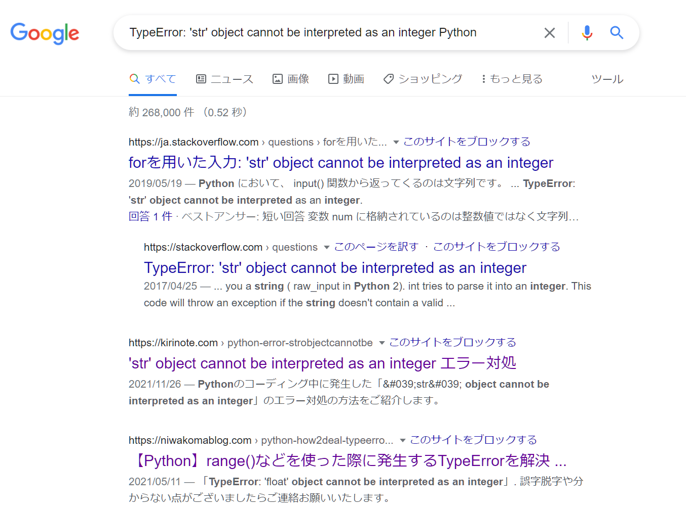

# プログラミングを学ぶコツ

ここでは、ワークを終えて「なんとなくプログラミングというものに触れてみたぞ」という方が、今後どのように学んでいけばいいかのコツやヒントについて、説明します。

## 学ぶための道具

「プログラミングを始めよう」の項目でも触れたように、プログラミングを学ぶための道具、教材は色々なものがあります。

ここでは、講師がオススメする教材を挙げておきます。

### 書籍

プログラミング未経験で、かつ自分で学ぶ場合には、なるべく易しいものを選ぶとよいでしょう。

書籍の中で最も易しく書かれているのは、「ふりがな」シリーズです。

参考：[『ふりがなプログラミング』シリーズのご紹介 – リブロワークス – LibroWorks](https://libroworks.co.jp/?p=1976)

書籍中に出てくるサンプルのプログラムに、漢字の「ふりがな」のように、細かく意味が書かれています。

本自体も薄く内容も絞られているので、最初に読むのにはオススメです。

!>プログラミング関連書籍の中には「はじめての」や「やさしい」などのワードが付いた書籍がたくさんありますが、**本当の初学者にとっては決して優しくない場合も多い**です。できれば、実際に本屋さんに行って、中をめくって「これならわかりそう」というものからスタートしましょう。分厚い本は確かに内容も充実していますが、**学びを止めないこと**を第一優先にしてください。

書籍であれば、次に紹介する学習サイトとは異なり、電車での移動中などちょっとした時間でも学ぶことができます。

### ネット上の学習サイト

- [Progate | プログラミングの入門なら基礎から学べるProgate[プロゲート]](https://prog-8.com/)
- [環境構築不要！初心者でも楽しく学習できるプログラミング入門サービス【paizaラーニング】](https://paiza.jp/works)
- [ドットインストール - 3分動画でマスターできるプログラミング学習サービス](https://dotinstall.com/)

これらのサービスは月額料金がかかりますが、ブラウザ上でプログラムを書いて実行ができる便利なサービスです。

初心者がつまづきがちな環境構築をしなくともプログラミングにふれることが出来る点、画面の指示に従ってゲーム感覚で課題をクリアしていくため書籍に比べて飽きにくい点でオススメです。

## とにかく書いてみる

プログラミングは、本を読んだり動画を見たりするだけでは身につきません。

闇雲に書けばいいわけではありませんが、プログラムを一定量書くことは、身につけるうえでの大切なトレーニングです。

とはいっても、あてもなくプログラミングをするのは難しいですよね。

たとえば以下のサイトを参考に、プログラミングの「筋トレ」をするつもりで練習問題を解いてみると、ゲーム感覚で自然とプログラミングが身についていきます。

## 質問の仕方

プログラミングに限った話ではないですが、とても大切です。

質問をする際には、

そもそも、何をしたかったのか→本来、どういう状態になりたかったのか→具体的にどんな作業をしたか→その結果、どういう状態になったのか

の順に相手に伝えましょう。

ご参考：[新人エンジニアが絶対に身に着けておくべき「質問の仕方」 - テストウフ](https://yoshikiito.net/blog/archives/793/)

## エラーが出たときは

エラーは長めの文章が表示される場合がありますが、注目すべきポイントは絞られます。

基本的には

- 波線が引かれた部分
- ＊＊＊＊Error：～～～～　のように、エラーとその詳細が書いてある部分
- 行の最初に`Error`や`>`や`->`など、「ここがエラーですよ」と明示されている部分

にまずは注目しましょう。

エラーメッセージ、たとえば

> TypeError: 'str' object cannot be interpreted as an integer

のような文章が表示された場合には、まずはその文章＋`Python`、で検索してみましょう。

> 

検索をすることで、解決のヒントになるかもしれないサイトが出てきます。

### 検索結果から有益な情報を選ぶときに気をつける点

サイトによって、情報の信頼度は異なります。

プログラミングをする人がよく参考にするサイトとしては

- stackoverflow
  - 日本語と英語それぞれのサイトがあるが、英語版推奨
- Qiita
  - 日本語の技術記事投稿サイト
- Zenn
  - 日本語の技術記事投稿サイト
- その他個人ブログ

などがあります。

一方で、あまり参考にすべきでないサイトの特徴として、以下が挙げられます。（以下に当てはまるサイトがすべて信頼できないわけではありませんが、傾向がある、と考えます。）

- 不自然な日本語で書かれたサイト
  - stackoverflowなどを機械翻訳して量産されたコピーサイトの可能性がある
- 「＊＊＊エンジニア塾」など、エンジニア転職サービスなどの運営元が開設しているサイト
  - 良く言えば素人向けに解説されているが、言い方を変えると、不正確な情報を平気で載せている場合がある
- アフィリエイトなど、情報提供ではなく収益を主目的としたサイト
  - 例えば「プログラミングスクールランキング」や「＊＊＊なプログラミング教材＊選」のような記事を量産していて、記事中のリンクが、各種公式サイトではなくアフィリエイトサイトばかりである（a8.netやaccesstradeやvaluecommarceの文字がURLに入っている）サイト

上記に当てはまるサイトは、エンジニアとしての知識やスキルがない人が書いていたり、質問や回答・情報提供ではなく金銭的な利益のみを狙ったサイトの可能性があります。プログラミングに関して調べ物をする際には注意しましょう。